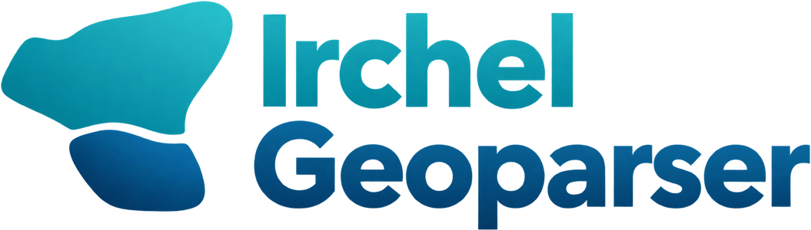

<p align="center">
  
</p>

[](https://github.com/dguzh/geoparser/actions/workflows/test.yml?query=branch%3Amain+)
[](https://coverage-badge.samuelcolvin.workers.dev/redirect/dguzh/geoparser)
[](https://pypi.org/project/geoparser)
[](https://pepy.tech/projects/geoparser)
[](https://pypi.org/project/geoparser)
[](https://github.com/dguzh/geoparser/blob/main/LICENSE)

A Python library for extracting place names from text and linking them to geographic locations.

Geoparsing is split into two stages, and the library keeps them separate: a *recognizer* finds which words are place names, and a *resolver* decides which place each name refers to, choosing from the entries of a *gazetteer*. You supply the recognizer, the resolver, and the gazetteer explicitly, and each can be exchanged for another: a module can be replaced by one that works differently, pointed at a different underlying model, or fine-tuned on your own annotated data, and you can write a module of your own against a small interface. The library ships gazetteer configurations for the modern world and for Switzerland, and other geographic data becomes a gazetteer through a YAML configuration file, with no code to write.

## Installation

```bash
pip install geoparser
```

The library also needs a gazetteer, which is not bundled: it is the database of places that names are resolved against.

```bash
python -m geoparser install geonames
```

See the [installation guide](https://docs.geoparser.app/en/latest/installation.html) for environment setup, the available gazetteers, and their disk requirements.

## Quick Start

```python
from geoparser import Geoparser
from geoparser.modules import SentenceTransformerResolver, SpacyRecognizer

# Build a pipeline from a recognizer and a resolver
geoparser = Geoparser(
    recognizer=SpacyRecognizer(),
    resolver=SentenceTransformerResolver(gazetteer_name="geonames"),
)

# Parse text
document = geoparser.parse(
    "The conference was held in Zurich, with satellite events in Geneva and Basel."
)

# Access results
for toponym in document.toponyms:
    location = toponym.location  # None if the name could not be resolved
    print(f"{toponym.text} -> {location.data['name']}, {location.data['country_name']} "
          f"({location.data['latitude']}, {location.data['longitude']})")
```

```text
Zurich -> Zürich, Switzerland (47.36667, 8.55)
Geneva -> Geneva, Switzerland (46.20222, 6.14569)
Basel -> Basel, Switzerland (47.55839, 7.57327)
```

Each name here has been tied to one specific entry in GeoNames, so besides the name and coordinates printed above you also have a stable identifier for the place, what kind of place it is, the administrative units it belongs to, and a geometry you can map, measure, or export.

## Documentation

Full documentation, including setup, guides, and the API reference, is available at **[docs.geoparser.app](https://docs.geoparser.app)**.

## Project Status

The library is under active development and its architecture is still evolving; while the version remains below `1.0`, minor releases may make breaking changes. [ROADMAP.md](ROADMAP.md) describes the larger changes we intend to make.

## Contributing

Questions, bug reports, and ideas are always welcome via [issues](https://github.com/dguzh/geoparser/issues). Pull requests are appreciated too — see [CONTRIBUTING.md](CONTRIBUTING.md) for local setup and development guidelines.

## Acknowledgments

The Irchel Geoparser originated as part of Diego Gomes' Master's thesis and was further developed with support from the [Department of Geography](https://www.geo.uzh.ch/) at the University of Zurich and the [Public Data Lab](https://publicdatalab.ch/) of the Digitalization Initiative of the Zurich Higher Education Institutions. We thank Prof. Dr. Ross Purves for the opportunity to continue this work as part of a research project.

## License

This project is licensed under the MIT License - see the [LICENSE](LICENSE) file for details.

Geoparser depends on a number of third-party libraries, listed in [pyproject.toml](pyproject.toml). Each is distributed separately under its own license, which pip installs alongside it.
